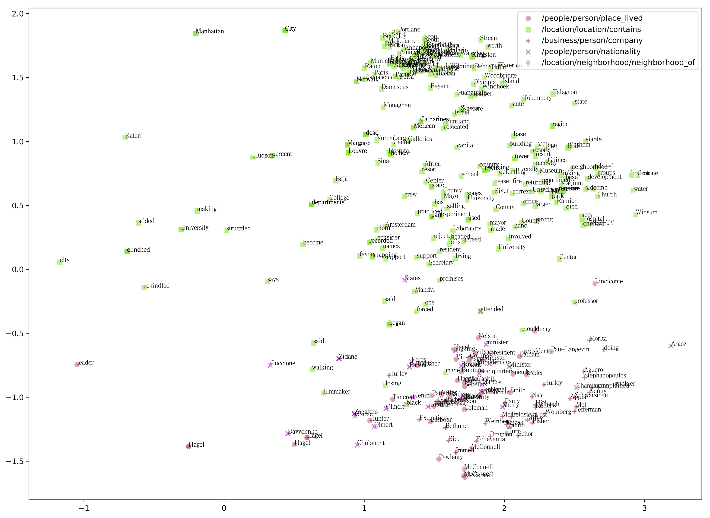
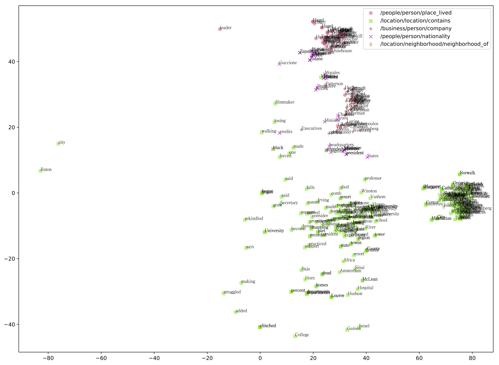

## GRNN4TE ([Project Tutorial](https://sssgrowth.github.io/GRNN4TE/))  
#### As long as this paper is accepted, this project is publicly available. 

GRNN4TE is a framework to accelerate graph data processing and lifelong triple extraction research. It is a preview. The detailed descriptions are still in the making.

### Contents

* [Basics](#basics)
  * [Installation](#installation)
  * [Addition](#addition)
    * [Model visualization](#model-visualization)
    * [Data visualization analysis](#data-visualization-analysis)
* [Citation](#citation) 
* [Updating](#updating)

## Contents
### Addition
#### Model visualization
  
Figure 1. Dimensionality reduction for vertices with PCA  
Different colors denote different relation types. As shown in Figure 1, PCA tends to reveal the semantic relationship between relation types. We first observe that there are two main clusters, where the cluster of “contains” and “neighbor_of ” relations describes the relationship between locations, while the other cluster describes the relations about person and organization/location. The lower part of the diagram shows the relations of “place lived”, “company” and “nationality” are closely related, but the relations are mixed. t-SNE tends to show a more accurate relationship between relations. As shown in Figure 2, the “placed lived” is closer to “nationality”. “nationality” is closely related to “company”, while the “place lived” is not always close to “company”. This phenomenon is also in line with the actual situation. This GRNN, by leveraging vertex embeddings, provides better understanding about relations. This means the vertex embeddings encode the semantic relationship between relation types.  
  
Figure 2. Dimensionality reduction for vertices with t-SNE
## Updating...

* 2018-Jun-10, GRNN v0.1, initial version, builing a new framework, graph recursive neural network, for graph data processing and lifelong relation extraction
* 2018-Nov-03, GRNN4TE v0.2, enhancing joint representation learning
* 2019-Jan-20, GRNN4TE v0.2, compatible with pre-trained BERT
* 2019-Mar-20, GRNN4TE v0.2, supporting vertex visualization for interpretability and adding optimized graph search